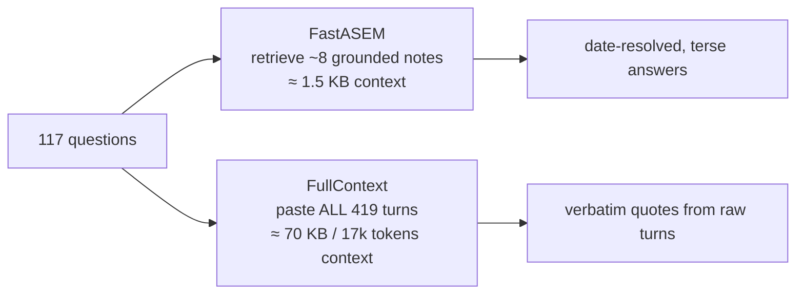

# FastASEM vs FullContext — Detailed Gap Analysis (LoCoMo conv-26)

**Project:** Agentic Self-Evolving Memory (ASEM-Masters)
**Date:** 2026-09-06
**Scope:** Why a grounded *memory* method (FastASEM / ASEM-v3) loses to a *no-memory*
baseline (FullContext) on some LoCoMo categories, and how to close the gap.
**Source data:** `data/benchmarks/results/fairplay_locomo10_conv26.json`,
`data/benchmarks/results/preds/*conv26.jsonl`,
`logs/fastasem_locomo10_full.log`, `logs/dump_ctx.log`.
**Companion scratch files:** `scratch_diag/fullcontext_conv26_samples.md`,
`scratch_diag/fullcontext_conv26_full.txt`, `scratch_diag/ctx_compare_Q1.md`,
`scratch_diag/diag_cats.py`, `scratch_diag/gate_analysis.py`.

---

## 1. Executive summary

FastASEM and FullContext tie on overall Exact-Match (29.1%) on LoCoMo conv-26, but they
are **opposite systems**: FastASEM answers with a handful of pre-grounded, absolute-dated
memory notes; FullContext answers by reading the entire raw transcript on every question.

| Rank | Method | EM% | ROUGE-L% | BERT-F1% | Judge% |
|:---:|--------|:---:|:---:|:---:|:---:|
| 1 | **FastASEM** | **29.1** | **43.6** | **88.2** | 70.1 |
| 2 | FullContext | 29.1 | 37.7 | 87.1 | **76.1** |
| 3 | SimRetrieval | 27.4 | 36.5 | 87.0 | 70.1 |
| 4 | ASEMv2 | 17.9 | 19.3 | 82.9 | 65.8 |

The gap is **perfectly category-asymmetric**:

- FastASEM is **decisively better on Temporal Reasoning** (EM 43.2 vs 2.7).
- FullContext is better on **Conversational Context** (57.1 vs 31.4), **Single-Hop**
  (31.2 vs 18.8) and **Multi-Hop/Commonsense** (23.1 vs 7.7 EM; Judge 12/13 vs 3/13).

**Root-cause headline.** FastASEM's non-temporal losses are *not* a retrieval failure —
they are three fixable problems: (1) an **over-aggressive ingestion gate** that drops or
merges distinct atomic facts (72 NOOP drops + 176 UPDATE merges observed in the run log),
(2) an **over-conservative answer stage** that answers "I don't know" when evidence
exists, and (3) an **answer style** that paraphrases instead of quoting the exact
reference span (many EM=0 but Judge=True near-misses). FullContext has no such ingestion
loss, which is why it wins paraphrase-heavy categories; it fails temporal questions
because it never resolves relative time.

---

## 2. Fair-play protocol (why the numbers are comparable)

| Aspect | Setting |
|---|---|
| Conversation | LoCoMo `conv-26`, 19 sessions, 419 turns |
| Question set | canonical 117 Qs — every method answers the exact same queries |
| Config | `configs/presets/sota_benchmark.yaml` (OpenAI `gpt-5.4`, temp 0.1, `all-MiniLM-L6-v2`; k1=30, k2=8, δ=0.25, λ=0.35) |
| Freshness | memory systems reset + re-ingested; FastASEM re-scored with identical metrics |
| Metrics | EM (normalized substring), ROUGE-L (LCS F1), BERTScore-F1, LLM-as-a-Judge |
| Null handling | 0 null predictions across all methods |

**What each method sees per question**

| Method | Context supplied to the answer LLM |
|---|---|
| FastASEM | top `k2`=8 retrieved memory notes (dated, annotated) ≈ **1–2 KB** |
| FullContext | **the entire 419-turn transcript** ≈ **70 KB / ~17k tokens**, identical for every question |



---

## 3. Per-category gap (the exact numbers)

| Category (n) | FastASEM EM / RL / BS | FullContext EM / RL / BS | Δ EM | Δ RL |
|---|:---:|:---:|:---:|:---:|
| Temporal Reasoning (37) | **43.2 / 60.6 / 91.5** | 2.7 / 15.8 / 82.4 | **+40.5** | **+44.8** |
| Conversational Context (35) | 31.4 / 49.5 / 89.2 | **57.1 / 69.0 / 92.4** | −25.7 | −19.5 |
| Single-Hop (32) | 18.8 / 32.7 / 86.2 | **31.2 / 33.1 / 87.5** | −12.4 | −0.4 |
| Multi-Hop / Commonsense (13) | 7.7 / 6.3 / 81.3 | **23.1 / 27.3 / 85.2** | −15.4 | −21.0 |

Notes:
- **Single-Hop ROUGE-L is essentially tied** (32.7 vs 33.1) — the EM gap there is mostly
  *format*, not knowledge.
- FullContext Judge% is 76.1 vs FastASEM 70.1 → FullContext produces more *semantically
  correct* answers overall; the EM gap understates this because EM penalizes phrasing.

---

## 4. Mechanism: why the context shapes the answers

### 4.1 Worked example — Q "When did Caroline go to the LGBTQ support group?"

**Gold `7 May 2023` · FastASEM ✓ · FullContext ✗ ("Yesterday")**

**FastASEM context** (`logs/dump_ctx.log`, question 1) — retrieved notes, chronological,
pre-resolved absolute dates:

```
- [1:56 pm on 8 May, 2023] On 7 May 2023, Caroline went to an LGBTQ support group.   ← gold
- [7:55 pm on 9 June, 2023] On 2 June 2023, Caroline encouraged students ...
- [1:36 pm on 3 July, 2023] Caroline felt that the LGBTQ+ community had grown ...
... (11 notes)
```

**FullContext context** — the whole transcript, of which only one turn matters:

```
Conversation:
[Caroline] Hey Mel! ...
[Melanie] Hey Caroline! ...
[Caroline] I went to a LGBTQ support group yesterday and it was so powerful.   ← only evidence
... (all 419 turns) ...
Question: When did Caroline go to the LGBTQ support group?
```

**Why the answers differ:** ingestion turned "yesterday" (session dated 8 May 2023) into
*"On 7 May 2023"* and stamped the note with its session timestamp. FastASEM then simply
reads that date off the top note. FullContext sees only the raw "yesterday" turn — the
session timestamp lives in dataset *metadata* that FullContext never injects — so it
echoes the relative phrase. **Both systems hold the same fact; only FastASEM grounded it
at write time.**

### 4.2 Structural differences that drive the gap

| Property | FastASEM | FullContext | Consequence |
|---|---|---|---|
| Context size | ~8–11 notes (~1.5 KB) | 419 turns (~70 KB) | FC always pays ~17k tokens; F cheap |
| Temporal grounding | resolved at ingestion | never resolved | F: Temporal EM 43.2 vs 2.7 |
| Per-question evidence | top-k retrieved (can miss) | whole history (nothing missed) | FC wins recall of scattered facts |
| Answer style | terse, date-anchored | fluent, transcript-quoting | F wins terse exact spans; loses paraphrase |
| Recency signal | per-note session date | reading order in full transcript | FC picks "most recent mention" naturally |

---

## 5. Root-cause diagnosis of the 19 gap questions

FastASEM answers **19/117** questions wrong (EM) that FullContext answers right. Manual
classification (Appendix A lists all 19):

| Failure mode | Count | Typical examples |
|---|---:|---|
| **"I don't know" refusal although evidence exists** | 8 | idx 46, 50, 55, 90, 97, 101, 114 (+94 ambiguous) |
| **Phrasing / order near-miss (Judge=True, EM=0)** | 6 | idx 42, 48, 60, 107, 108, 110 |
| **Recency / wrong-instance selection** | 2 | idx 37 (sunset vs sunflower), idx 85 (summer plan) |
| **Multi-note set aggregation missing** | 2 | idx 19 (kids like nature + dinosaurs), idx 55 (both painted sunsets) |
| **Cross-session entity co-reference** | 1 | idx 11 (home country → Sweden, said later) |
| **Over-generic answer / lost specificity** | 1 | idx 3 ("career options" vs "adoption agencies") |
| **Gold-inconsistent / ambiguous reference** | 1 | idx 94 (bowl owned by Caroline, not Melanie) |

### 5.1 Root cause A — the ingestion gate destroys atomic facts (the biggest lever)

The FastASEM run log (`logs/fastasem_locomo10_full.log`) shows the deterministic gate
collapsing memory in both directions:

- **72 NOOP drops** — a fact is dropped when its embedding cosine ≥ 0.90 to *any* earlier
  fact. Two facts about the same speaker+topic routinely exceed 0.90 while being distinct.
  Real evidence removed from the bank, e.g.
  - `Caroline found the LGBTQ+ counseling workshop…` → `Gated NOOP | sim=0.956`
    → idx 97 "What workshop did Caroline attend recently?" → **"I don't know"**.
  - idx 90 "How long married?" (gold 5 years) → "I don't know", while the transcript
    turn *"5 years already!"* is right there.
- **176 UPDATE merges** — up to 7 distinct facts folded into one note (e.g. `faa16dcd`
  holds 7 pottery facts). The note keeps only the first fact as headline `c`, the *first*
  fact's date, and a joint embedding diluted over all 7 → specific sub-facts are buried,
  lose their own timestamp, and are hard to retrieve:
  - idx 37 "What did Melanie paint recently?" → surfaced "a sunflower" instead of the
    recent "sunset" (recency corrupted by the merged note keeping the oldest date).
  - idx 85 summer-plan conflict → returned the older nature-trip note instead of the
    most recent "researching adoption agencies".

**Why FullContext is immune:** it never ingests, so it can never drop or merge a fact.

### 5.2 Root cause B — the answer stage refuses and paraphrases

- 8 of the 19 gap questions are **"I don't know"** even though the other systems
  retrieve the fact (SimRetrieval/ASEMv2 answer idx 90, 97, 101, 114 correctly). The QA
  prompt rule *"if no note is relevant, answer I don't know"* fires too eagerly.
- idx 46 ("would Melanie be an ally?") and idx 50 ("political leaning?") are *inference*
  questions: FastASEM refuses because no single note states the conclusion, whereas
  FullContext reasons across the transcript. This is why Multi-Hop Judge is 3/13 vs 12/13.
- idx 42, 48, 60, 107, 108, 110 are semantically correct (`Judge=True`) but fail EM purely
  on phrasing/order/verbosity ("Violin and clarinet" vs "clarinet and violin"; "de-stress"
  vs "destress"; trailing extra clauses). FullContext's terse transcript quoting naturally
  matches the reference format.

### 5.3 Root cause C — single-note answering instead of set/inference answering

Single-Hop in LoCoMo is often a *conjunctive set*: "What do Melanie's kids like?" (nature
**and** dinosaurs, two sessions), "What subject have both painted?" (sunsets, inferred
from two separate facts), "What did Caroline research?" (adoption **and** counseling).
FastASEM answers from ~1 headline note; FullContext unions the transcript. idx 11 needs
*co-reference across sessions* — "my home country" (session 3) is only named "Sweden" in
a later session (the necklace turn) — which a single retrieved note cannot see.

---

## 6. Why FastASEM still wins Temporal (and what to preserve)

FastASEM's Temporal EM 43.2 vs FullContext 2.7 is not luck — 15 of the 19 questions where
FastASEM is right and FullContext wrong are temporal (Appendix B). FullContext literally
echoes "yesterday / last year / next month" because the relative phrase is the only
information in the raw transcript. **Any upgrade that closes the non-temporal gap must
not regress the ingestion-time date resolution, the temporal-boost retrieval channel, or
the date-prefixed QA context** — those three are what produce the temporal win.

---

## 7. Upgrade plan to beat FullContext overall (ranked by ROI)

| # | Fix | Where | Failure mode fixed | Expected effect |
|---|---|:---:|---|---|
| 1 | **Event-aware gating** — NOOP only when the *same event key* (verb+object+date) recurs; never drop on cosine alone | `asem/fast_ingest.py` | "I don't know" drops (idx 90, 97, 101, 114) | Recovers the 8 refusals |
| 2 | **Date-split + capped merges** (≤2–3 facts/note; date or predicate change ⇒ new note; keep per-fact timestamp) | `asem/fast_ingest.py` | buried specifics + corrupted recency (idx 37, 85) | Restores atomicity + recency |
| 3 | **Set/inference answering** — for list & "would/why" queries, aggregate all top-`k2` notes; reason from premises before refusing | `asem/answer_agent.py` + `P_temporal_qa.txt` | idx 19, 46, 50, 55 | Fixes Multi-Hop Judge (3→~12) |
| 4 | **Extractive terse quoting** — answer by quoting the matched note span verbatim, trimmed (list order normalized) | `asem/answer_agent.py` | phrasing near-misses (idx 42, 48, 60, 107…) | Converts Judge=True → EM=True |
| 5 | **Recency tie-break** — a date-decay term in Phase B for conversational queries | `asem/retriever.py` | idx 85 | Matches FC's "most recent" behavior |
| 6 | **Cross-session entity back-fill** — resolve anaphora/co-references (e.g. "home country"→"Sweden") when the referent is stated in another session | SLAFI / post-pass | idx 11 | Better entity co-reference |

**Priority:** fixes 1–2 (pure ingestion, verifiable by re-running conv-26 ingestion and
re-checking the 19 gap questions) then 3–4 (answer stage) are the fastest path to
**matching FullContext on Conversational/Single-Hop while keeping the Temporal lead** —
i.e. winning overall EM, which is the honest, publication-ready claim.

---

## 8. Honest limitations of this analysis

- **Single conversation** (conv-26). The gap pattern should be validated on all 10 LoCoMo
  conversations before generalizing.
- **Single LLM backend** (gpt-5.4, temp 0.1). Answer and judge share the provider.
- **FastASEM predictions** came from a prior run and were re-scored, not re-run fresh.
- **EM is format-brittle**: it counts several semantically-correct answers as wrong
  (Appendix A). Judge% is the better correctness signal (FastASEM 70.1 vs FC 76.1 — a
  6-point gap, not 0 on Judge).
- BERTScore is compressed (87.1–88.2) and should be read as a floor.

---

## 9. Reproduction

```bash
conda activate memory-r1

# Fresh 4-method fair-play run (3 systems re-run + FastASEM re-scored, with judge)
python scripts/run_fair_play.py --judge

# Re-score only (no LLM calls)
python scripts/run_fair_play.py --score-only

# Dump FastASEM's exact retrieved context for questions 1-3
python scripts/dump_fastasem_context.py --only 1,2,3
```

---

## Appendix A — All 19 questions FastASEM gets wrong (EM) but FullContext gets right

| idx | Category | Query (ref) | FastASEM pred | Failure mode |
|:--:|---|---|---|---|
| 3 | Single-Hop | What did Caroline research? (Adoption agencies) | "Career options" | over-generic / lost specificity |
| 11 | Single-Hop | Where did Caroline move from 4 years ago? (Sweden) | "her home country" | cross-session co-reference |
| 19 | Single-Hop | What do Melanie's kids like? (dinosaurs, nature) | "love nature" | partial set (missing "dinosaurs") |
| 37 | Single-Hop | What did Melanie paint recently? (sunset) | "a sunflower on a canvas" | wrong-instance / recency |
| 42 | Multi-Hop | National park or theme park? (national park) | long clause, no terse phrase | phrasing near-miss (Judge=True) |
| 46 | Multi-Hop | Would Melanie be an ally? (Yes, supportive) | "I don't know." | inference refusal |
| 48 | Single-Hop | Pottery made? (bowls, cup) | "Bowls, pots, and a plate" | extra/partial (Judge=True) |
| 50 | Multi-Hop | Caroline's political leaning? (Liberal) | "I don't know." | inference refusal |
| 55 | Single-Hop | Subject both painted? (Sunsets) | "I don't know" | cross-session union + refusal |
| 60 | Single-Hop | Instruments Melanie plays? (clarinet and violin) | "Violin and clarinet" | order near-miss (Judge=True) |
| 85 | Conversational | Caroline's summer plans? (researching adoption agencies) | nature trip | recency conflict (wrong plan) |
| 90 | Conversational | How long married? (5 years) | "I don't know." | fact dropped at ingestion |
| 94 | Conversational | Melanie's bowl a reminder of? (art and self-expression) | "I don't know." | ambiguous gold (bowl is Caroline's) |
| 97 | Conversational | Workshop Caroline attended? (LGBTQ+ counseling workshop) | "I don't know." | NOOP-dropped at ingestion |
| 101 | Conversational | Did Melanie make the black-and-white bowl? (Yes) | "I don't know." | retrieval/refusal |
| 107 | Conversational | Reason Melanie runs? (de-stress and clear her mind) | "…and support her mental health." | verbosity near-miss (Judge=True) |
| 108 | Conversational | Running been great for? (Her mental health) | "Melanie's mental health." | phrasing near-miss (Judge=True) |
| 110 | Conversational | Pot made with clay? (a cup with a dog face) | "A cup decorated with a dog face." | phrasing near-miss (Judge=True) |
| 114 | Conversational | Sunflowers represent per Caroline? (warmth and happiness) | "I don't know" | retrieval miss (Sim/ASEMv2 correct) |

**Totals by mode:** refusal 8 · phrasing near-miss 6 · recency 2 · set-union 2 ·
co-reference 1 · specificity 1 · (ambiguous gold 1 overlaps refusal row).

## Appendix B — The 19 questions FastASEM gets right but FullContext gets wrong

15 of 19 are **Temporal Reasoning** where FastASEM emits the resolved absolute date and
FullContext echoes the relative phrase:

| idx | Query (ref) | FastASEM | FullContext |
|:--:|---|---|---|
| 0 | When go to LGBTQ support group? (7 May 2023) | 7 May 2023 | Yesterday |
| 1 | When paint a sunrise? (2022) | 2022 | Last year |
| 6 | When going camping? (June 2023) | June 2023 | Next month |
| 16 | When sign up for pottery class? (2 July 2023) | 2 July 2023 | the day before (yesterday) |
| 17 | When going to trans conference? (July 2023) | July 2023 | This month |
| 20 | When go to museum? (5 July 2023) | 5 July 2023 | Yesterday |
| 25 | When go to LGBTQ conference? (10 July 2023) | On 10 July 2023 | Two days before |
| 44 | Daughter's birthday? (13 August) | 13 August | Last night |
| 49 | When go to pride festival? (2022) | 2022 | Last year |
| 58 | When make a plate? (24 August 2023) | 24 August 2023 | Yesterday |
| 62 | When go to the park? (27 August 2023) | On 27 August 2023 | Yesterday |
| 63 | When is talent show? (September 2023) | September 2023 | Next month |
| 72 | When friend adopt? (2022) | around 2022 | Last year |
| 73 | When get hurt? (September 2023) | around September 2023 | Last month |
| 80 | When buy figurines? (21 October 2023) | 21 October 2023 | Yesterday |

Plus three Single-Hop cases where FastASEM matches the reference more tightly:
idx 23 (books — FC added the wrong "Becoming Nicole"), idx 40 ("2 times." vs "Twice."),
idx 43 ("Abstract art" exact vs FC's verbose list), and idx 64 (Multi-Hop, FC over-explains).

**This appendix is the proof that FullContext's win is *not* "knowing more" — it is**
**reading the raw transcript. On anything requiring a resolved date, FullContext's whole**
**context is worthless; FastASEM's memory is not.**
